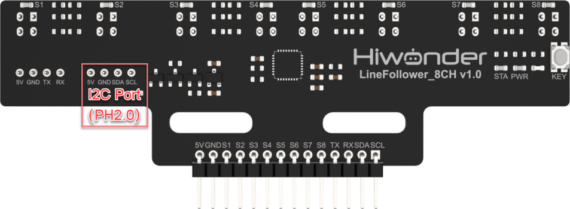
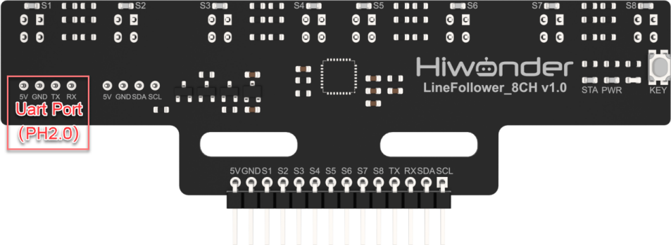
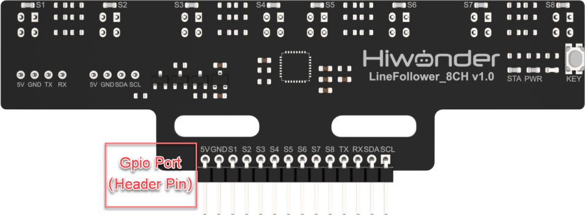
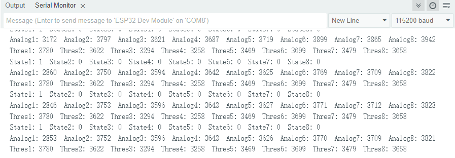

# 1. 8-ch Line Follower Introduction

## 1.1 Product Introduction

The 8-ch Line Follower is developed based on a high-performance 32-bit ARM chip. It integrates eight industrial-grade infrared sensors, an MCU control core, and other high-quality components, enabling it to handle complex line-following tasks with ease—including sharp right-angle turns, tight U-turns, curves, and various types of intersections such as T-junctions and cross paths. It supports adaptive line width detection and works well with a wide range of track layouts. With standardized mounting holes, the 8-ch Line Follower is compatible with most mainstream controllers. It's ideal for smart wheeled robot development across various drive configurations—whether two-wheel drive, four-wheel differential, Mecanum wheels, omnidirectional wheels, or Ackermann chassis.

## 1.2 Working Principle

The sensor emits and receives infrared light through its infrared probes. The stronger the infrared reflection, the higher the output, while the weaker the reflection, the lower the output. The signal data is then processed by the high-performance 32-bit ARM chip. Based on the signal strength, the corresponding LED on each probe is controlled, and the data is transmitted to other control units via the output interface.

The sensor features an innovative one-click intelligent calibration technology, eliminating the need for preset adjustments. With a button press, calibration can be completed within 1 minute.

## 1.3 Notice

:::{Note}

Do not exceed the rated voltage range during use.

:::

Before use, adjust the detection height to ensure that the probe height during recognition matches the height used during calibration.

## 1.4 Specifications

The parameters are suitable for Mecanum wheel, differential drive, tank chassis, and Ackermann chassis.

<table  class="docutils-nobg" border="1">
  <tr>
    <th colspan="2">8-ch Line Follower</th>
  </tr>
  <tr>
    <th>Parameter</th>
    <th>Specification</th>
  </tr>
  <tr>
    <td>Power Supply</td>
    <td>DC 5V</td>
  </tr>
  <tr>
    <td>Operating Current</td>
    <td>85mA</td>
  </tr>
  <tr>
    <td>Operating Temperature</td>
    <td>-10℃~60℃</td>
  </tr>
  <tr>
    <td>Effective Measurement Range</td>
    <td>0.5cm to 8cm</td>
  </tr>
  <tr>
    <td>Output Interfaces</td>
    <td>8 IO ports, I2C port, UART port</td>
  </tr>
  <tr>
    <td>I2C Address (7-bit)</td>
    <td>0x5D</td>
  </tr>
  <tr>
    <td>Output Signals</td>
    <td>Digital and Analog Signals</td>
  </tr>
  <tr>
    <td>Product Dimensions</td>
    <td>107 x 31.2 x 10.57mm (L x W x H)</td>
  </tr>
  <tr>
    <td>Mounting Hole Size</td>
    <td>M2.5 or M3 Copper Pillars, Screws</td>
  </tr>
</table>

## 1.5 Pin Instruction

**1.5.1 I2C Pins**

| **Pin** | **Instruction** |
|:-------:|:---------------:|
|   5V    |   Power Input   |
|   GND   |     Ground      |
|   SDA   | SDA Data Cable  |
|   SCL   | SCL Clock Line  |

**1.5.2 UART Pins**

| **Pin** |     **Instruction**     |
|:-------:|:-----------------------:|
|   5V    |       Power input       |
|   GND   |         Ground          |
|   TX    | Data Transmission Cable |
|   RX    |  Data Reception Cable   |

**1.5.3 GPIO Pins**

| **Pin** |     **Instruction**     |
|:-------:|:-----------------------:|
|   5V    |       Power Input       |
|   GND   |         Ground          |
|   S1    |     Channel 1 GPIO      |
|   S2    |     Channel 2 GPIO      |
|   S3    |     Channel 3 GPIO      |
|   S4    |     Channel 4 GPIO      |
|   S5    |     Channel 5 GPIO      |
|   S6    |     Channel 6 GPIO      |
|   S7    |     Channel 7 GPIO      |
|   S8    |     Channel 8 GPIO      |
|   TX    | Data Transmission Cable |
|   RX    |  Data Reception Cable   |
|   SDA   |     SDA Data Cable      |
|   SCL   |     SCL Clock Line      |

:::{Note}

Please ensure that the wiring is done exactly as shown in the tutorial!

:::

## 1.6 Project Outcome

You can refer to the case tutorials and programs for different platforms in the same directory as this tutorial. This section will demonstrate the testing effect using Arduino IDE as an example.

The 8-ch Line Follower uses its onboard sensors to detect the learned background and target colors, and prints the results via the serial port.

