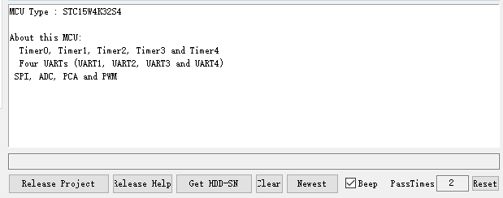
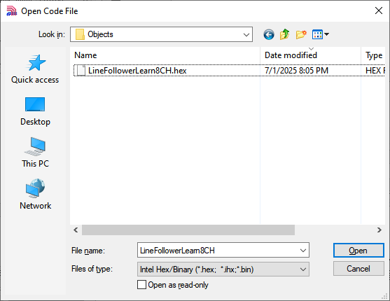
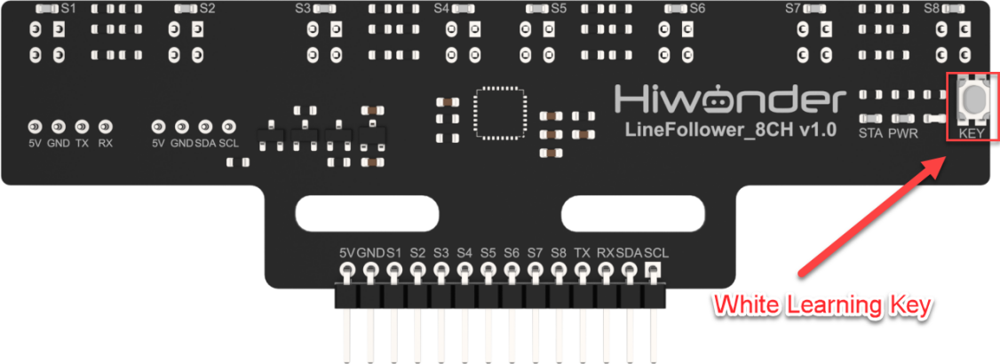

# 2. Quick Start

## 2.1 8-ch Line Follower User Manual

### 2.1.1 Overview

This section will guide you through how to use the 8-ch Line Follower and help you get started quickly. The sensor consists of eight industrial-grade infrared sensors and features a learning key that allows it to adapt to different grayscale values for various line-following tasks.

### 2.2.2 Usage Steps

* **Wiring**

Taking the 51 microcontroller as an example, the sensor is connected to the prepared controller using the I2C interface. The wiring is shown in the diagram below:

* **Program Download**

Download the corresponding program to the controller, using C51 controller in this example.

(1) Connect the C51 controller to your computer using a USB data cable.

(2) Open the program file located in the same directory as this document: [Program\LineFollowerLearn8CH_I2C_Test](Appendix.md)

(3) Double-click to open the download tool [AIapp-ISP-v6.95E](Appendix.md). In the software, select the correct COM port from the dropdown menu. The COM port number may vary depending on your computer. **Do not select COM1, as it is reserved for system communication.**

(4) Click the "**Check MCU**" button. Then press the K1 reset button on the control board. The onboard LED will flash once, and the software will automatically detect the chip model. The detected chip model will be shown in the upper-left “**MCU Type**” field, and logs will appear in the bottom-right output panel.

:::{Note}

If the LED does not flash or the chip is not detected, try pressing the K1 button multiple times quickly.

:::

(5) Click "**Open Code File**", navigate to the folder **LineFollowerLearn8CH_I2C_Test\Objects**, and select the generated **HEX** file.

(6) Click "**Download/Program**", then press the K1 reset button again. The software will begin flashing the firmware. Once the output log displays the message shown below, the download has completed successfully.

* **Grayscale Learning**

(1) Move the sensor to the background color you want to learn. Press and hold the white learning key, and the sensor will automatically learn the grayscale value of the background color. The outer four LEDs will flash during the background learning process. When all LEDs begin flashing, it indicates successful learning. You can then release the white learning key.

(2) Move the sensor to the target tracking color you want to learn. Press the white learning key briefly, and the sensor will automatically learn the grayscale value of the target tracking color. The inner four LEDs will flash during target learning. When all LEDs start flashing at a normal speed, it indicates successful learning. If learning fails, all LEDs will flashing fast.

* **Test Outcome**

In this example, we will use white as the background color and black as the target tracking color. Place the sensor on the black color. When the target color is detected, the LED on the corresponding channel will light up.

## 2.2 8-ch Line Follower Communication Protocol

### 2.2.1 Overview

This section will guide you through the core communication protocol of the 8-ch Line Follower, helping you understand its design logic and secondary development. With the standardized protocol, you can quickly implement multi-sensor collaborative control, laying the foundation for projects such as robot navigation and industrial automation.

### 2.2.2 Communication Protocol Overview

The 8-ch Line Follower offers three flexible communication interface options to meet the needs of various application scenarios:

(1) I2C Communication: Uses the standard I2C bus protocol, supporting multiple devices in parallel, making it ideal for applications that require saving IO pins.

(2) UART Communication: Provides a serial asynchronous communication interface, supporting customizable baud rates for easy connection with various control devices.

(3) GPIO Communication: Outputs parallel digital signals with fast response times, making it suitable for applications that demand high real-time performance.

* **I2C Communication Protocol**

The I2C communication protocol address for the 8-ch Line Follower sensor is 0x5D, a fixed address. You can read the sensor data by accessing the register addresses of the 8-ch Line Follower sensor.

The following is the register mapping table for the 8-ch Line Follower's data simulation values:

| Register Address |              Function              | Data Type | Data Length |          Data Format           |
| :--------------: | :--------------------------------: | :-------: | :---------: | :----------------------------: |
|        5         |  Read all sensor digital results   |  uint8_t  |   1 byte    |                                |
|        6         | Read sensor 1 channel analog value | uint16_t  |   2 bytes   | Low byte first, high byte last |
|        8         | Read sensor 2 channel analog value | uint16_t  |   2 bytes   | Low byte first, high byte last |
|        10        | Read sensor 3 channel analog value | uint16_t  |   2 bytes   | Low byte first, high byte last |
|        12        | Read sensor 4 channel analog value | uint16_t  |   2 bytes   | Low byte first, high byte last |
|        14        | Read sensor 5 channel analog value | uint16_t  |   2 bytes   | Low byte first, high byte last |
|        16        | Read sensor 6 channel analog value | uint16_t  |   2 bytes   | Low byte first, high byte last |
|        18        | Read sensor 7 channel analog value | uint16_t  |   2 bytes   | Low byte first, high byte last |
|        20        | Read sensor 8 channel analog value | uint16_t  |   2 bytes   | Low byte first, high byte last |

The following is the register mapping table for the 8-ch Line Follower's data threshold values:

| Register Address |            Function             | Data Type | Data Length |          Data Format           |
| :--------------: | :-----------------------------: | :-------: | :---------: | :----------------------------: |
|        22        | Read sensor 1 channel threshold | uint16_t  |   2 bytes   | Low byte first, high byte last |
|        24        | Read sensor 2 channel threshold | uint16_t  |   2 bytes   | Low byte first, high byte last |
|        26        | Read sensor 3 channel threshold | uint16_t  |   2 bytes   | Low byte first, high byte last |
|        28        | Read sensor 4 channel threshold | uint16_t  |   2 bytes   | Low byte first, high byte last |
|        30        | Read sensor 5 channel threshold | uint16_t  |   2 bytes   | Low byte first, high byte last |
|        32        | Read sensor 6 channel threshold | uint16_t  |   2 bytes   | Low byte first, high byte last |
|        34        | Read sensor 7 channel threshold | uint16_t  |   2 bytes   | Low byte first, high byte last |
|        36        | Read sensor 8 channel threshold | uint16_t  |   2 bytes   | Low byte first, high byte last |

* **UART Communication Protocol**

The UART communication protocol for the 8-ch Line Follower supports four initialization modes:

|         Initialization Mode         | Configuration Command |
| :---------------------------------: | :-------------------: |
|        Manual Configuration         |           0           |
|   Automatically Send Level Values   |           1           |
|  Automatically Send Analog Values   |           2           |
| Automatically Send Threshold Values |           3           |

About the manual mode, where after sending the read command, the controller will receive the corresponding data from the sensor.

Related Read Commands:

1: Return level value by 1 byte of data.

2: Read analog value and returns data according to the following UART protocol.

3: Read threshold value and returns data according to the following UART protocol.

:::{Note}

Once the operation mode is configured, it cannot be reconfigured. To switch modes, the system needs to be reset and reinitialized.

:::

The following is the UART protocol for the 8-ch Line Follower:

* **GPIO Communication Protocol**

GPIO, abbreviated form of General-Purpose Input/Output, is a flexible hardware interface that allows microcontrollers to communicate with external devices through digital pins, such as MCUs and SoCs. It does not rely on a specific protocol, but rather uses level signals (high/low) for simple control or data transmission. GPIO is commonly found in embedded systems, sensors, LED control, and other scenarios.

The 8-ch Line Follower can directly read the IO pins of the corresponding sensor channels and detect when a target outputs a low-level signal.

:::{Note}

The data returned is the opposite of the level signal read via I2C/UART.

:::