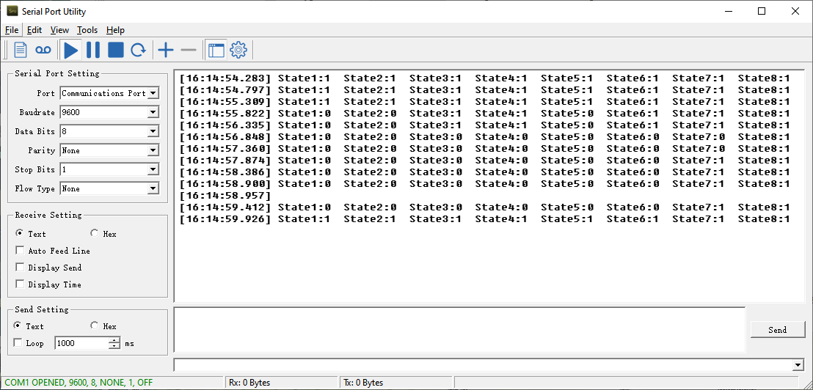

# 4. STM32 Communication

## 4.1 IIC Communication Instruction

### 4.1.1 Getting Started

* **Wiring Instruction**

Connect the 5V, GND, SDA, and SCL pins of the 8-ch Line Follower to the corresponding pins on the STM32 controller. The wiring method is shown in the diagram below:


:::{Note}
Before powering on, ensure that no metal objects are touching the controller. Otherwise, the exposed pins at the bottom of the board may cause a short circuit and damage the controller.
:::

* **Program Download**

[Source Code]()

(1) Connect the controller to the computer using a USB cable.

(2) Double-click to open the STM32 serial programming software [FlyMcu](Appendix.md).


(3) Click the "**...**" icon and select the HEX file to be programmed from the path: [Robot\MDK-ARM\Robot](Appendix.md).


(4) In position ①, select the corresponding serial port number for the controller. In position ②, set the baud rate to 115200. In positions ③ and ④, configure the options as shown in the image.


(5) Click "**Start ISP(P)**", then press the **RST** button on the controller. The program will automatically begin downloading. Once the following content appears in the log output on the right, the program download will be complete.

### 4.1.2 Test Case

* **Project Outcome**

:::{Note}
Before recognition, you need to perform the one-click intelligent calibration for the sensor to ensure proper detection.
:::

Once the 8-ch Line Follower detects the corresponding color of the line-following target, the serial port will print the status, analog values, and threshold values of each sensor. The printed data will appear as follows:



* **Program Brief Analysis**

[Source Code]()

(1) First, the program-related libraries and the line-following sensor library need to be imported. The line-following sensor library contains the functional interfaces for the sensor.

{lineno-start=18}
```python
/* Includes ------------------------------------------------------------------*/
#include "main.h"
#include "adc.h"
#include "dma.h"
#include "i2c.h"
#include "spi.h"
#include "tim.h"
#include "usart.h"
#include "gpio.h"

/* Private includes ----------------------------------------------------------*/
/* USER CODE BEGIN Includes */

#include "global.h"
#include "stdio.h"
#include "stdlib.h"
#include "led.h"
#include "buzzer.h"
#include "adc_sample.h"
#include "LineFollow.h"
/* USER CODE END Includes */
```

(2) In the main function, the relevant hardware is initialized, and the `LineFollowIIC_init()` function is called to initialize the line-following sensor in manual transmission mode. In this mode, the main controller must send a read command to the sensor to obtain the corresponding data.

{lineno-start=92}
```python
  /* Reset of all peripherals, Initializes the Flash interface and the Systick. */
  HAL_Init();

  /* USER CODE BEGIN Init */

  /* USER CODE END Init */

  /* Configure the system clock */
  SystemClock_Config();

  /* USER CODE BEGIN SysInit */
  __HAL_RCC_I2C1_CLK_ENABLE();
  __HAL_RCC_DMA1_CLK_ENABLE();  
  /* USER CODE END SysInit */

  /* Initialize all configured peripherals */
  MX_GPIO_Init();
  MX_DMA_Init();
  MX_TIM3_Init();
  MX_USART3_UART_Init();
  MX_SPI1_Init();
  MX_USART1_UART_Init();
  MX_ADC1_Init();
  MX_I2C1_Init();
  MX_TIM4_Init();
  MX_USART2_UART_Init();

  /* Initialize interrupts */
  MX_NVIC_Init();
  /* USER CODE BEGIN 2 */
  led_init();
  LineFollowIIC_init();
```

(3) In the sensor's initialization function, calling this function will interact with the sensor's address through `LineFollow.write_data()`, `LineFollow.read_data()`, and `LineFollow.dev_addr`.

{lineno-start=59}
```python
void LineFollowIIC_init()
{
	memset(&LineFollow, 0, sizeof(LineFollow));
	LineFollow.write_data = write_data;
	LineFollow.read_data = read_data;
	LineFollow.dev_addr = LineFollow_ADDRESS;
}
```

(4) In the while loop, to get the sensor's level value, for example, the `LineFollowIIC_State()` function is used to obtain the level status of the four line-following sensors, and the results are stored in the `LineFollowLearn` object. The data is then printed out via the serial port.

{lineno-start=129}
```python
  while (1)
  {	
    /* USER CODE END WHILE */
    /* USER CODE BEGIN 3 */
		
		/*  Read State */
		LineFollowIIC_State(&LineFollowLearn);
		printf("State1:%d  State2:%d  State3:%d  State4:%d  State5:%d  State6:%d  State7:%d  State8:%d\r\n",
		 LineFollowLearn.data[0], LineFollowLearn.data[1], LineFollowLearn.data[2], LineFollowLearn.data[3],
		 LineFollowLearn.data[4], LineFollowLearn.data[5], LineFollowLearn.data[6], LineFollowLearn.data[7]);
			
		/*  Read Analog */
		LineFollowIIC_Analog(&LineFollowLearn);
		printf("Analog1:%d  Analog2:%d  Analog3:%d  Analog4:%d  Analog5:%d  Analog6:%d  Analog7:%d  Analog8:%d\r\n",
		 LineFollowLearn.data[0], LineFollowLearn.data[1], LineFollowLearn.data[2], LineFollowLearn.data[3],
		 LineFollowLearn.data[4], LineFollowLearn.data[5], LineFollowLearn.data[6], LineFollowLearn.data[7]);
		
		/*  Read Threshold */
		LineFollowIIC_Threshold(&LineFollowLearn);
		printf("Threshold1:%d  Threshold2:%d  Threshold3:%d  Threshold4:%d  Threshold5:%d  Threshold6:%d  Threshold7:%d  Threshold8:%d\r\n",
		 LineFollowLearn.data[0], LineFollowLearn.data[1], LineFollowLearn.data[2], LineFollowLearn.data[3],
		 LineFollowLearn.data[4], LineFollowLearn.data[5], LineFollowLearn.data[6], LineFollowLearn.data[7]);

		HAL_Delay(400);
  }
  /* USER CODE END 3 */
}
```

(5) In the implementation of `LineFollowIIC_State()`, the data type is first checked, and the `HAL_I2C_STATE_READY()` function is used to acquire the I2C data. Finally, a for loop is used to parse the data, and the level data of each sensing unit is obtained.

{lineno-start=67}
```python
bool LineFollowIIC_State(LineFollowHandleTypeDef* State)
{
	if(receive_from_device(&LineFollow, LineFollow_STATE_REG, LineFollow.results, 1))
	{
		while(HAL_I2C_STATE_READY != HAL_I2C_GetState(&hi2c1));
		for(int i=0; i<sizeof(LineFollow.data);i++){
			State->data[i] = (LineFollow.results[0] >> i) & 0x01;
		}
		return true;
	}
	return false;
}
```

## 4.2 UART Communication Instruction

### 4.2.1 Preparation

* **Wiring Instruction**

Connect the 5V, GND, TX, and RX pins of the 8-ch Line Follower to the corresponding pins on the STM32 controller. The wiring method is shown in the diagram below:


:::{Note}
Before powering on, ensure that no metal objects are touching the controller. Otherwise, the exposed pins at the bottom of the board may cause a short circuit and damage the controller.
:::

* **Program Download**

[Source Code]()

(1) Connect the controller to the computer using a USB cable.

(2) Double-click to open the STM32 serial programming software [FlyMcu](Appendix.md). 

(3) Click the "**...**" icon and select the HEX file to be programmed from the path: [Robot\MDK-ARM\Robot](Appendix.md).


(4) In position ①, select the corresponding serial port number for the controller. In position ②, set the baud rate to 115200. In positions ③ and ④, configure the options as shown in the image.


(5) Click "**Start ISP(P)**", then press the **RST** button on the controller. The program will automatically begin downloading. Once the following content appears in the log output on the right, the program download will be complete.


### 4.4.2 Test Case

* **Project Outcome**

:::{Note}
Before recognition, you need to perform the one-click intelligent calibration for the sensor to ensure proper detection.
:::

When the 8-channel line follower detects a line of the corresponding color, the status of each sensor channel will be printed via the serial port. The program allows switching between displaying analog values and threshold values.


* **Program Brief Analysis**

[Source Code]()

(1) First, the program-related libraries and the line-following sensor library need to be imported. The line-following sensor library contains the functional interfaces for the sensor.

{lineno-start=18}
```python
/* Includes ------------------------------------------------------------------*/
#include "main.h"
#include "adc.h"
#include "dma.h"
#include "i2c.h"
#include "spi.h"
#include "tim.h"
#include "usart.h"
#include "gpio.h"

/* Private includes ----------------------------------------------------------*/
/* USER CODE BEGIN Includes */

#include "global.h"
#include "stdio.h"
#include "stdlib.h"
#include "led.h"
#include "buzzer.h"
#include "adc_sample.h"
#include "LineFollow.h"
/* USER CODE END Includes */
```

(2) In the main function, the relevant hardware is initialized, and the `LineFollowUART_init()` function is called to initialize the line-following sensor in manual transmission mode. In this mode, the main controller must send a read command to the sensor to obtain the corresponding data.

{lineno-start=94}
```python
  HAL_Init();

  /* USER CODE BEGIN Init */

  /* USER CODE END Init */

  /* Configure the system clock */
  SystemClock_Config();

  /* USER CODE BEGIN SysInit */
  __HAL_RCC_I2C1_CLK_ENABLE();
  __HAL_RCC_DMA1_CLK_ENABLE();  
  /* USER CODE END SysInit */

  /* Initialize all configured peripherals */
  MX_GPIO_Init();
  MX_DMA_Init();
  MX_TIM3_Init();
  MX_USART3_UART_Init();
  MX_SPI1_Init();
  MX_USART1_UART_Init();
  MX_ADC1_Init();
  MX_I2C1_Init();
  MX_TIM4_Init();
  MX_USART2_UART_Init();

  /* Initialize interrupts */
  MX_NVIC_Init();
  /* USER CODE BEGIN 2 */
  led_init();
  LineFollowUART_init(LINEFOLLOW_MODE_MANUAL);
```

(3) In the sensor initialization function, the `LineFollow_write_and_read()` function is used to send a command to set the working mode of the sensor. Important: The sensor only accepts this working mode command once after power-up. If you want to switch modes, you must power cycle the sensor and then send the command again.

{lineno-start=155}
```python
void LineFollowUART_init(uint8_t Mode)
{
		memset(&LineFollow, 0, sizeof(LineFollow));
    __HAL_UART_CLEAR_FLAG(&huart2, UART_FLAG_TXE);
    __HAL_UART_CLEAR_FLAG(&huart2, UART_FLAG_TC);
    __HAL_UART_CLEAR_FLAG(&huart2, UART_FLAG_RXNE);
		LineFollow.work_mode = Mode;
		LineFollow_write_and_read(&LineFollow, LineFollow.work_mode, true);
		LineFollow.it_state = LINEFOLLOW_WRITE_DATA_READY;
}
```

(4) In the while loop, to get the sensor's level value, for example, the `LineFollowUART_State()` function is used to obtain the level status of the four line-following sensors, and the results are stored in the `LineFollowLearn` object. The data is then printed out via the serial port. Because the working mode in UART mode can only be changed by power cycling, it is not possible to print digital values, analog values, and threshold values at the same time.

{lineno-start=130}
```python
  while (1)
  {	
    /* USER CODE END WHILE */
    /* USER CODE BEGIN 3 */
		
		/*  Read State */
		LineFollowUART_State(&LineFollowLearn);
		printf("State1:%d  State2:%d  State3:%d  State4:%d  State5:%d  State6:%d  State7:%d  State8:%d\r\n",
		 LineFollowLearn.data[0], LineFollowLearn.data[1], LineFollowLearn.data[2], LineFollowLearn.data[3],
		 LineFollowLearn.data[4], LineFollowLearn.data[5], LineFollowLearn.data[6], LineFollowLearn.data[7]);
		
		/*  Read Analog */
//		LineFollowUART_Analog(&LineFollowLearn);
//		printf("Analog1:%d  Analog2:%d  Analog3:%d  Analog4:%d  Analog5:%d  Analog6:%d  Analog7:%d  Analog8:%d\r\n",
//		 LineFollowLearn.data[0], LineFollowLearn.data[1], LineFollowLearn.data[2], LineFollowLearn.data[3],
//		 LineFollowLearn.data[4], LineFollowLearn.data[5], LineFollowLearn.data[6], LineFollowLearn.data[7]);
		
		/*  Read Threshold */
//		LineFollowUART_Threshold(&LineFollowLearn);
//		printf("Threshold1:%d  Threshold2:%d  Threshold3:%d  Threshold4:%d  Threshold5:%d  Threshold6:%d  Threshold7:%d  Threshold8:%d\r\n",
//		 LineFollowLearn.data[0], LineFollowLearn.data[1], LineFollowLearn.data[2], LineFollowLearn.data[3],
//		 LineFollowLearn.data[4], LineFollowLearn.data[5], LineFollowLearn.data[6], LineFollowLearn.data[7]);

		HAL_Delay(400);
  }
  /* USER CODE END 3 */
}
```

(5) In the implementation of `LineFollowUART_State()`, the working mode is first checked. If the mode is manual transmission, `LineFollow_write_and_read()` is used to send the `LINEFOLLOW_MODE_MANUAL_STATE` command to request digital state data from the sensor. According to the protocol, the returned data is 1 byte. A for loop is then used to parse each bit, allowing the digital state of each probe to be obtained.

{lineno-start=166}
```python
bool LineFollowUART_State(LineFollowHandleTypeDef* State)
{
	if(LineFollow.work_mode == LINEFOLLOW_MODE_MANUAL)
	{
		LineFollow.manual_mode = LINEFOLLOW_MODE_MANUAL_STATE;
		if (0 == LineFollow_write_and_read(&LineFollow, LINEFOLLOW_MODE_MANUAL_STATE, false)) 
		{
			for(int i=0; i<sizeof(LineFollow.data);i++){
				State->data[i] = (LineFollow.results[0] >> i) & 0x01;
			}
			LineFollow.it_state = LINEFOLLOW_WRITE_DATA_READY;
			return true;
		}
	}

```

(6) If the mode is automatic transmission, no command needs to be sent manually. Instead, `LINEFOLLOW_CMD_NULL` is used as the argument, indicating that no data is sent to the sensor. When the sensor returns data, a loop is used to parse it.

{lineno-start=180}
```python
	else
	{
		if (0 == LineFollow_write_and_read(&LineFollow, LINEFOLLOW_CMD_NULL, false)) 
		{
			for(int i=0; i<sizeof(LineFollow.data);i++){
				State->data[i] = (LineFollow.results[0] >> i) & 0x01;
			}
			LineFollow.it_state = LINEFOLLOW_WRITE_DATA_READY;
			return false;
		}
	}
    	
	return false;
}

```

(7) In the `LineFollowUART_Analog()` function, the data from the sensor is sent in data frame format. According to the UART protocol, each frame contains a frame header, command, data length, data, and checksum. Once a frame is received, the `LineFollow_rx_handler()` function verifies and processes the data. The parsed analog values are then stored in `LineFollow.results`. A for loop separates the high and low 8 bits of each data point and combines them to reconstruct the full analog values.

{lineno-start=195}
```python
bool LineFollowUART_Analog(LineFollowHandleTypeDef* Analog)
{
	uint8_t count = 0;
	if(LineFollow.work_mode == LINEFOLLOW_MODE_MANUAL)
	{
		LineFollow.manual_mode = LINEFOLLOW_MODE_MANUAL_ANALOG;
		if (0 == LineFollow_write_and_read(&LineFollow, LINEFOLLOW_MODE_MANUAL_ANALOG, false)) 
		{
			for(int i=0; i<sizeof(LineFollow.data);i++){
				Analog->data[i] = LineFollow.results[count] | (LineFollow.results[count+1] << 8);
				count += 2;
			}
			LineFollow.it_state = LINEFOLLOW_WRITE_DATA_READY;
			return true;
		}
	}
	else
	{
		if (0 == LineFollow_write_and_read(&LineFollow, LINEFOLLOW_CMD_NULL, false)) 
		{
			for(int i=0; i<sizeof(LineFollow.data);i++){
				Analog->data[i] = LineFollow.results[count] | (LineFollow.results[count+1] << 8);
				count += 2;
			}
			LineFollow.it_state = LINEFOLLOW_WRITE_DATA_READY;
			return true;
		}
	}
	
	return false;
}
```

(8) The `LineFollowUART_Threshold()` function follows the same reception and parsing process as `LineFollowUART_Analog()`, except that the returned data represents threshold values instead of analog ones.

{lineno-start=227}
```python
bool LineFollowUART_Threshold(LineFollowHandleTypeDef* Threshold)
{
	uint8_t count = 0;
	if(LineFollow.work_mode == LINEFOLLOW_MODE_MANUAL)
	{
		LineFollow.manual_mode = LINEFOLLOW_MODE_MANUAL_THRESHOLD;
		if (0 == LineFollow_write_and_read(&LineFollow, LINEFOLLOW_MODE_MANUAL_THRESHOLD, false)) 
		{
			for(int i=0; i<sizeof(LineFollow.data);i++){
				Threshold->data[i] = LineFollow.results[count] | (LineFollow.results[count+1] << 8);
				count += 2;
			}
			LineFollow.it_state = LINEFOLLOW_WRITE_DATA_READY;
			return true;
		}
	}
	else
	{
		if (0 == LineFollow_write_and_read(&LineFollow, LINEFOLLOW_CMD_NULL, false)) 
		{
			for(int i=0; i<sizeof(LineFollow.data);i++){
				Threshold->data[i] = LineFollow.results[count] | (LineFollow.results[count+1] << 8);
				count += 2;
			}
			LineFollow.it_state = LINEFOLLOW_WRITE_DATA_READY;
			return true;
		}
	}
	
	return false;
}
```