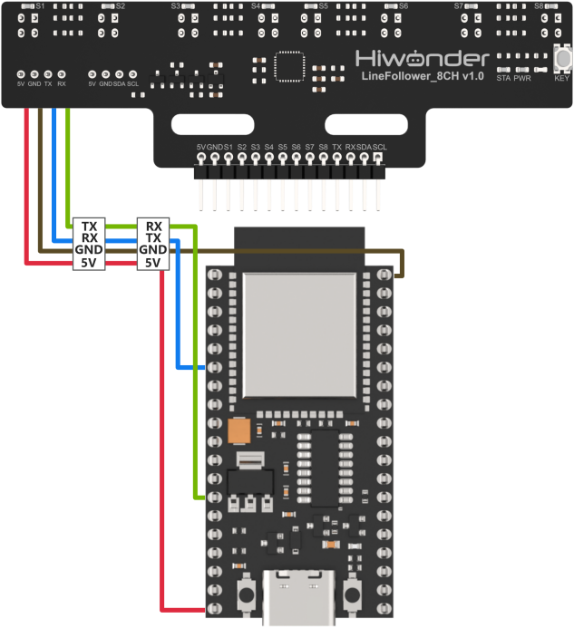

# 5. ESP32 Communication

## 5.1 IIC Communication Instruction

### 5.1.1 Getting Started

* **Wiring Instruction**

Connect the 5V, GND, SDA, and SCL pins of the 8-ch Line Follower to the corresponding pins on the ESP controller. The wiring method is shown in the diagram below:


:::{Note}

Before powering on, ensure that no metal objects are touching the controller. Otherwise, the exposed pins at the bottom of the board may cause a short circuit and damage the controller.

:::

* **Program Download**

[Source Code](../_static/source_code/ESP32.zip)

(1) Connect the ESP32 controller to your computer using a USB cable.

(2) Open the program file located in the same directory as this document: [Program\LineFollowerLearn8CH_I2C_Test](Appendix.md)


(3) Select ESP32 DEV Module as the development board and choose the correct port number.


(4) Then click the button  to upload the program to the ESP controller and wait for it to complete.


### 5.1.2 Test Case

This section uses the ESP32 controller to obtain the recognition results from the 8-ch Line Follower and print them through the serial port.

* **Project Outcome**

:::{Note}

Before recognition, you need to perform the one-click intelligent calibration for the sensor to ensure proper detection.

:::

Once the 8-ch Line Follower detects the corresponding color of the line-following target, the serial port will print the status, analog values, and threshold values of each sensor. The printed data will appear as follows:


* **Program Brief Analysis**

(1) The Wire.h library is imported, which contains the I2C communication class.

{lineno-start=14}

```
#include "Wire.h"
```

(2) Define macros for the number of channels of the 8-channel sensor, which is set to 8, as well as macros for the sensor address and register addresses.

{lineno-start=7}

```
#define SENSOR_SUM 8  //Number of sensor channels (传感器通道数)

#define I2C_ADDR 0x5D //Sensor I2C address (传感器I2C地址)

#define SensorStateReg      (5u)  //Sensor state data register address (传感器全通道状态数据寄存器地址)
#define SensorAnalogReg     (6u)  //Sensor channel 1 analog value register (low 8 bits) address (传感器通道1模拟值寄存器低8位地址)
#define SensorThresholdReg  (22u) //Sensor channel 1 threshold register (low 8 bits) address (传感器通道1阈值寄存器低8位地址)
```

(3) In the setup function, initialize the serial port with Serial.begin() and set the baud rate to 115200. Initialize I2C communication with Wire.begin().

{lineno-start=15}

```
void setup() 
{
  Serial.begin(115200); //Initialize serial (初始化串口)
  Wire.begin(I2C_SDA, I2C_SCL, 400*1000); //Initialize I2C (初始化I2C)
}
```

(4) Use Wire.beginTransmission() to start communication with the specified device address and send the status register address to begin data transmission. Use Wire.requestFrom() to request 1 byte of data and store it in the temp array.

{lineno-start=26}

```
  Wire.beginTransmission(I2C_ADDR); //Start communication (开始通信)
  Wire.write(SensorStateReg); //Send state data register address (发送状态数据寄存器地址)
  Wire.endTransmission();

  Wire.requestFrom(I2C_ADDR, 1);  //Send read request for 1 byte of data (发送读请求，请求1Byte数据)
  Wire.readBytes(temp, 1);  //Read 1 byte of data into temp (读取1Byte数据，保存到temp)
```

(5) Process the retrieved sensor channel status data and print the results. After the task is completed, end the communication.

{lineno-start=32}

```
  for(uint8_t len = 0; len < SENSOR_SUM; len++)
  {
    data[len]= ((temp[0] >> len) & 0x01); //Parse data to extract channel state values (解析数据，提取各通道状态值)
    Serial.printf("  State%d: ", len+1);Serial.print(data[len]);  // Print sensor state values via serial (串口打印传感器各通道状态)
  }
  Serial.println();
  Wire.endTransmission(); //End communication (结束通信)
  delay(10);
```

(6) Next, start communication by specifying the sensor’s analog value register address.

{lineno-start=41}

```
  Wire.beginTransmission(I2C_ADDR); //Start communication (开始通信)
  Wire.write(SensorAnalogReg);  //Send analog value register address (发送模拟值寄存器地址)
  Wire.endTransmission();
```

(7) Request the analog values of all sensor channels, save and process the retrieved data, then print the output.

{lineno-start=63}

```
  Wire.requestFrom(I2C_ADDR, SENSOR_SUM*2); //Send read request for 8*2 bytes of data (发送读请求，请求8*2 Byte数据，请求8个通道的全部数据)
  Wire.readBytes(temp, SENSOR_SUM*2); //Read 8*2 bytes of data into temp (读取8*2 Byte数据，保存到temp，读取8个通道的全部数据)
  Wire.endTransmission(); //End communication (结束通信)

  count = 0;
  for(uint8_t len = 0; len < SENSOR_SUM; len++)
	{
    data[len]= (temp[count]) | (temp[count+1]<<8);  //Combine low and high 8-bit threshold values into 16-bit (解析数据，把各通道阈值低8位和高8位数据合并为16位数据)
    Serial.printf("  Thres%d: ", len+1);Serial.print(data[len]);  //Print threshold values of each sensor channel via serial (串口打印传感器各通道阈值)
    count += 2;
  }
  delay(5000);
```

## 5.2 UART Communication Instruction

### 5.2.1 Preparation

* **Wiring Instruction**

Connect the 5V, GND, TX, and RX pins of the 8-ch Line Follower to the corresponding pins on the ESP controller. The wiring method is shown in the diagram below:




:::{Note}

Before powering on, ensure that no metal objects are touching the controller. Otherwise, the exposed pins at the bottom of the board may cause a short circuit and damage the controller.

:::

* **Program Download**

(1) Connect the ESP32 controller to your computer using a USB cable.

(2) Open the program file located in the same directory as this document: [Program\LineFollowerLearn8CH_I2C_Test](Appendix.md)


(3) Select ESP32 DEV Module as the development board and choose the correct port number.


(4) Then click the button  to upload the program to the ESP controller and wait for it to complete.


### 5.2.2 Test Case

This section uses the ESP32 controller to obtain the recognition results from the 8-ch Line Follower and print them through the serial port.

* **Project Outcome**

:::{Note}

Before recognition, you need to perform the one-click intelligent calibration for the sensor to ensure proper detection.

:::

Once the 8-ch Line Follower detects the corresponding color of the line-following target, the serial port will print the status, analog values, and threshold values of each sensor. The printed data will appear as follows:


*  **Program Brief Analysis**

(1) Macro definitions are used to specify the UART data input and output pins, define the number of channels for the 8-ch sensor as 8, and define the communication serial port as UART 1.

{lineno-start=2}

```
// Define UART pins (定义UART引脚)
#define UART_RX 35
#define UART_TX 12

#define SENSOR_SUM 8  //Number of sensor channels (传感器通道数)

HardwareSerial UART(1); //Define serial port for module communication (定义模块通信串口)
```

(2) In the setup function, the serial baud rate is initialized to 115200, followed by UART.begin() to initialize the communication serial port. Next, the program uses UART.write() to send a mode command, which sets the sensor to manual mode.

{lineno-start=26}

```
void setup()
{
  Serial.begin(115200); //Initialize debug serial port (初始化调试串口)
  UART.begin(115200, SERIAL_8N1,UART_RX, UART_TX); //Initialize communication serial port (初始化通信串口)
  
  Serial.println("Start test...");
  UART.write(0); // Set manual mode. 0: manual mode, 1: auto send status data, 2: auto send analog values, 3: auto send threshold (设置手动模式。0：手动模式，1：自动发送状态数据，2：自动发送模拟值，3：自动发送阈值)
}
```

(3) A WriteLock flag is defined to introduce a state lock for controlling the serial read/write status. If the write lock state is 0, the read-level status command is sent. Otherwise, the received data is saved, parsed, and printed out.

{lineno-start=36}

```
uint8_t WriteLock = 0;
void loop()
{
  uint16_t data[SENSOR_SUM] = {0};
  uint8_t temp[SENSOR_SUM*2+5] = {0};

  if(UART.availableForWrite() && 0 == WriteLock)  //Check write availability and write lock status (检测可写状态和写入锁状态)
  {
    UART.write(1); // Send read status command (发送读取状态指令)
    WriteLock = 1;
  }
  if(UART.available() && 1 == WriteLock)  //Check read availability and write lock status (检测可读状态和写入锁状态)
  {     
    UART.readBytes(temp, 1);  //Read 1 byte of data and save to temp (读取1Byte数据，保存到temp)
    for(uint8_t len = 0; len < SENSOR_SUM; len++)
    {
      data[len]= ((temp[0] >> len) & 0x01); //Parse data, extract status of each channel (解析数据，提取各通道状态值)
      Serial.printf("  State%d: ", len+1);Serial.print(data[len]);  //Print status of each sensor channel via serial (串口打印传感器各通道状态)
    }
    WriteLock = 0;  //Reset write lock to send next read command (写入锁清零，发送下一个读指令)
  }
  delay(10);
```

(4) The program checks the writable state and write lock status. Once the conditions are met, it sends the command to read the analog values.

{lineno-start=59}

```
  if(UART.availableForWrite() && 0 == WriteLock)
  {
    UART.write(2); // Send read analog value command (发送读取模拟值指令)
    WriteLock = 2;
  }
```

(5) The program then checks whether there is readable data in the serial buffer. If available, the data is parsed, and the analog values for each sensor channel are printed.

{lineno-start=64}

```
  if(UART.available() && 2 == WriteLock)
  {     
    UART.readBytes(temp, SENSOR_SUM*2+5); //Read 8*2+5 bytes of data and save to temp (读取8*2+5Byte数据，保存到temp)
    if(0x55 == temp[0] && 0xAA == temp[1])  //Verify frame header based on protocol (根据协议验证帧头)
    {
      if(0x02 == temp[2] && 0x10 == temp[3])  //Verify command and data length based on protocol (根据协议验证数据长度和读指令)
      {
        if(temp[SENSOR_SUM*2+4] == Check_Code(temp))  //Check checksum (校验码验证)
        {
          uint8_t count = 4;
          for(uint8_t len = 0; len < SENSOR_SUM; len++)
          {
            data[len]= (temp[count]) | (temp[count+1]<<8);  //Parse data, merge low and high 8-bit values into 16-bit value (解析数据，把各通道模拟值低8位和高8位数据合并为16位数据)
            Serial.printf("  Analog%d: ", len+1);Serial.print(data[len]); //Print analog value of each sensor channel via serial (串口打印传感器各通道模拟值)
            count += 2;
          }
        }
      }
    }
```