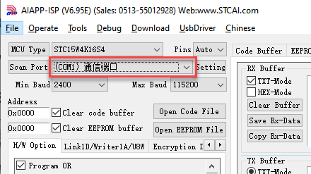

# 6. C51 Communication

## 6.1 IIC Communication Instruction

### 6.1.1 Getting Started

* **Wiring Instruction**

Connect the 5V, GND, SDA, and SCL pins of the 8-ch Line Follower to the corresponding pins on the C51 controller. The wiring method is shown in the diagram below:


:::{Note}
Before powering on, ensure that no metal objects are touching the controller. Otherwise, the exposed pins at the bottom of the board may cause a short circuit and damage the controller.
:::

* **Program Download**

[Source Code](../_static/source_code/C51.zip)

(1) Connect the C51 controller to your computer using a USB cable.

(2) Double-click to open the download tool [AIapp-ISP-v6.95E](Appendix.md). In the software, select the correct COM port from the dropdown menu. The COM port number may vary depending on your computer. **Do not select COM1, as it is reserved for system communication.**


(3) Click the **"Check MCU"** button. Then press the K1 reset button on the control board. The onboard LED will flash once, and the software will automatically detect the chip model. The detected chip model will be shown in the upper-left **"MCU Type"** field, and logs will appear in the bottom-right output panel.

:::{Note}
If the LED does not flash or the chip is not detected, try pressing the K1 button multiple times quickly.
:::


(4) Click **"Open Code File"**, navigate to the folder `LineFollowerLearn8CH\Objects`, and select the generated HEX file.


(5) Click **"Download/Program"**, then press the K1 reset button again. The software will begin flashing the firmware. Once the output log displays the message shown below, the download has completed successfully.


:::{Note}
If the download does not start automatically after pressing the button, try pressing the K1 button multiple times.
:::

### 6.1.2 Test Case

* **Project Outcome**

:::{Note}
Before recognition, you need to perform the one-click intelligent calibration for the sensor to ensure proper detection.
:::

Once the 8-ch Line Follower detects the corresponding color of the line-following target, the serial port will print the status, analog values, and threshold values of each sensor. The printed data will appear as follows:


* **Program Brief Analysis**

[Source Code](../_static/source_code/C51.zip)

(1) The corresponding libraries are imported, including **"LineFollowerLearn8CH.h"**, which provides support for the 8-ch line follower.

{lineno-start=1}

```c
#include "AI8051U.h"
#include "stdio.h"
#include "type.h"
#include "intrins.h"
#include "led.h"
#include "buzzer.h"
#include "pwm_servos.h"
#include "robot_arm.h"
#include "global.h"
#include "serial_servos.h"

#include "AI8051U_Uart.h"
#include "pc_porting.h"
#include "LineFollowerLearn8CH.h"
```

(2) The sensor communication method can be switched using a macro definition. In this case, set `linefollower_8ch_communication` to `sensor_IIC`.

{lineno-start=16}

```c
linefollower_8ch linefollower;
#define sensor_IIC  1                                        //8-channel line follower sensor IIC communication (八路巡线传感器IIC通信)
#define sensor_UART 2                                        //8-channel line follower sensor UART communication (八路巡线传感器UART通信)
#define linefollower_8ch_communication  sensor_IIC          //Macro definition to enable communication mode for 8-channel line follower sensor (八路巡线传感器通信方式使能宏定义)

```

(3) The program then initializes the timer base value and defines a delay function.

{lineno-start=29}

```c
/* Calculate timer initial value (计算定时器初值) */
#define TIMER0_INIT_VALUE (65536 - (TIME_us * (MAIN_Fosc / 1000000)) / 12)

#define ULTRASOUND_OFFSET 9.0f


//void Delay20ms(void)	//@40MHz
//{
//	unsigned long edata i;

//	_nop_();
//	_nop_();
//	i = 199998UL;
//	while (i) i--;
//}

void Delay200ms(void)	//@40MHz
{
	unsigned long edata i;

	_nop_();
	_nop_();
	i = 1999998UL;
	while (i) i--;
}

void Delay500ms(void)	//@40MHz
{
	unsigned long edata i;

	_nop_();
	_nop_();
	i = 4999998UL;
	while (i) i--;
}

void Delay1100ms(void)	//@40MHz
{
	unsigned long edata i;

	_nop_();
	_nop_();
	i = 10999998UL;
	while (i) i--;
}
```

(4) It checks the macro definition for the sensor connection method and performs initialization accordingly. For example, if the connection method is IIC, the program initializes the related IIC communication members of the sensor.

{lineno-start=116}

```c
#if (linefollower_8ch_communication == sensor_IIC)
	LineFollowerLearn8CH_IIC_init(); 
	
#elif (linefollower_8ch_communication == sensor_UART)
	LineFollowerLearn8CH_UART_init(&linefollower , manual_mode);  //Initialize the sensor object for UART communication and specify the working mode (初始化传感器对象用于UART通信相关的成员，指定工作模式)
```

(5) Inside the `while` loop, the connection type is first determined. If the connection is IIC, the program sends a request and parses the returned data to obtain each channel’s status, analog value, and threshold. The acquired low and high 8-bit values are combined into a 16-bit value.

{lineno-start=136}

```c
	while(1)
	{	
#if (linefollower_8ch_communication == sensor_IIC)		
		detect_state_all_channel_IIC(&linefollower);
		get_AnalogVoltage_all_channel_IIC(&linefollower);
		get_ThresholdValue_all_channel_IIC(&linefollower);
		
#elif (linefollower_8ch_communication == sensor_UART)
		
		Change_TransmitData_In_Mode_manual(Transmit_SensorState);
		while(! detect_state_all_channel_UART(&linefollower));

		Change_TransmitData_In_Mode_manual(Transmit_AnalogValue);		
		while(! get_AnalogVoltage_all_channel_UART(&linefollower));
		
		Change_TransmitData_In_Mode_manual(Transmit_ThresholdValue);
		while(! get_ThresholdValue_all_channel_UART(&linefollower));		

```

(6) In the `detect_state_all_channel_IIC()` function, sensor data is requested and parsed using `i2c_read_data()`. The results are extracted via a `for` loop to retrieve the status values for each channel.

{lineno-start=24}

```c
void detect_state_all_channel_IIC(linefollower_8ch *obj){
	uint8_t len=0;
	
	i2c_read_data(LineFollowerLearn8CH_I2C_ADDR << 1, SensorStateReg, &(obj->StateReg_OriginData), sizeof(obj->StateReg_OriginData));
	
	for(len = 0; len < SENSOR_SUM; len++)
	{
		obj->state_all_ch[len]= ((obj->StateReg_OriginData >> len) & 0x01); //Parse data to extract status value of each channel (??析数据，提取各????状态值)
	}
	
}
```

(7) The `get_AnalogVoltage_all_channel_IIC()` and `get_ThresholdValue_all_channel_IIC()` functions work similarly. The former retrieves and parses analog values from all channels, while the latter obtains and processes the threshold values. Both functions use `i2c_read_data()` to request and parse sensor data, then merge the low and high 8-bit values of each channel into 16-bit data in `for` loop.

{lineno-start=36}

```c
/**
 * @brief Get and parse analog values of each channel via IIC communication (IIC??信方式获取各????模拟量并??析)
 *
 * @param linefollower_8ch *obj：8-channel line follower object(八路巡线传感器对??)
 * @note SensorAnalogReg_OriginData is the raw data sent from the sensor, which can be used for debugging and observation. (SensorAnalogReg_OriginData为传感器发来的原始数据，可供调????测)
 */
void get_AnalogVoltage_all_channel_IIC(linefollower_8ch *obj){
	uint8_t len=0;
	uint8_t count=0;
	
	i2c_read_data(LineFollowerLearn8CH_I2C_ADDR << 1, SensorAnalogReg_ch1, obj->SensorAnalogReg_OriginData, sizeof(obj->SensorAnalogReg_OriginData));
	
	for(len = 0,count = 0; len < SENSOR_SUM; len++)
	{
		obj->AnalogVoltage_all_ch[len]= (obj->SensorAnalogReg_OriginData[count]) | (obj->SensorAnalogReg_OriginData[count+1]<<8);  //??析数据，把各????模拟值低8位和??8位数据合并为16位数据
		count += 2;
	}
}

/**
 * @brief Get and parse threshold values of each channel via IIC communication (IIC??信方式获取各??????值量并??析)
 *
 * @param linefollower_8ch *obj：8-channel line follower object(八路巡线传感器对??)
 * @note SensorThresholdReg_OriginData is the raw data sent from the sensor, which can be used for debugging and observation.(SensorThresholdReg_OriginData为传感器发来的原始数据，可供调????测)
 */
void get_ThresholdValue_all_channel_IIC(linefollower_8ch *obj){
	uint8_t len = 0;
	uint8_t count=0;

	i2c_read_data(LineFollowerLearn8CH_I2C_ADDR << 1, SensorThresholdReg_ch1, obj->SensorThresholdReg_OriginData, sizeof(obj->SensorThresholdReg_OriginData));
	
	for(len = 0,count = 0; len < SENSOR_SUM; len++)
	{
		obj->ThresholdVoltage_all_ch[len]= (obj->SensorThresholdReg_OriginData[count]) | (obj->SensorThresholdReg_OriginData[count+1]<<8);  //Parse data by combining low and high 8-bit data of analog values into 16-bit data for each channel (??析数据，把各????模拟值低8位和??8位数据合并为16位数据)
		count += 2;
	}
}
```

(8) Finally, the results are printed through the serial port.

{lineno-start=166}

```c
		sprintf(imformation_string,\
						"ch1:%hhu,ch2:%hhu,ch3:%hhu,ch4:%hhu,ch5:%hhu,ch6:%hhu,ch7:%hhu,ch8:%hhu\r\n",\
						linefollower.state_all_ch[0],linefollower.state_all_ch[1],linefollower.state_all_ch[2],linefollower.state_all_ch[3],\
						linefollower.state_all_ch[4],linefollower.state_all_ch[5],linefollower.state_all_ch[6],linefollower.state_all_ch[7]);
		uart1_Sendstring(imformation_string);
		Delay500ms();
		
		sprintf(imformation_string,\
						"analog1:%hu,analog2:%hu,analog3:%hu,analog4:%hu,analog5:%hu,analog6:%hu,analog7:%hu,analog8:%hu\r\n",\
						linefollower.AnalogVoltage_all_ch[0],linefollower.AnalogVoltage_all_ch[1],linefollower.AnalogVoltage_all_ch[2],\
						linefollower.AnalogVoltage_all_ch[3],linefollower.AnalogVoltage_all_ch[4],linefollower.AnalogVoltage_all_ch[5],\
						linefollower.AnalogVoltage_all_ch[6],linefollower.AnalogVoltage_all_ch[7]);
		uart1_Sendstring(imformation_string);
		Delay500ms();

		sprintf(imformation_string,\
						"Threshold1:%hu,Threshold2:%hu,Threshold3:%hu,Threshold4:%hu,Threshold5:%hu,Threshold6:%hu,Threshold7:%hu,Threshold8:%hu\r\n",\
						linefollower.ThresholdVoltage_all_ch[0],linefollower.ThresholdVoltage_all_ch[1],linefollower.ThresholdVoltage_all_ch[2],\
						linefollower.ThresholdVoltage_all_ch[3],linefollower.ThresholdVoltage_all_ch[4],linefollower.ThresholdVoltage_all_ch[5],\
						linefollower.ThresholdVoltage_all_ch[6],linefollower.ThresholdVoltage_all_ch[7]);
		uart1_Sendstring(imformation_string);	
		Delay500ms();	
```

## 6.2 UART Communication Instruction

### 6.2.1 Getting Started

* **Wiring Instruction**

Connect the 5V, GND, TX, and RX pins of the 8-ch Line Follower to the corresponding pins on the C51 controller. The wiring method is shown in the diagram below:


:::{Note}
Before powering on, ensure that no metal objects are touching the controller. Otherwise, the exposed pins at the bottom of the board may cause a short circuit and damage the controller.
:::

* **Program Download**

[Source Code](../_static/source_code/C51.zip)

(1) Connect the C51 controller to your computer using a USB cable.

(2) Double-click to open the download tool [AIapp-ISP-v6.95E](Appendix.md). In the software, select the correct COM port from the dropdown menu. The COM port number may vary depending on your computer. **Do not select COM1, as it is reserved for system communication.**



(3) Click the **"Check MCU"** button. Then press the K1 reset button on the control board. The onboard LED will flash once, and the software will automatically detect the chip model. The detected chip model will be shown in the upper-left **"MCU Type"** field, and logs will appear in the bottom-right output panel.

:::{Note}
If the LED does not flash or the chip is not detected, try pressing the K1 button multiple times quickly.
:::


(4) Click **"Open Code File"**, navigate to the folder `LineFollowerLearn8CH\Objects`, and select the generated HEX file.


(5) Click **"Download/Program"**, then press the K1 reset button again. The software will begin flashing the firmware. Once the output log displays the message shown below, the download has completed successfully.


:::{Note}
If the download does not start automatically after pressing the button, try pressing the K1 button multiple times.
:::

### 6.2.2 Test Case

* **Project Outcome**

:::{Note}
Before recognition, you need to perform the one-click intelligent calibration for the sensor to ensure proper detection.
:::

Once the 8-ch Line Follower detects the corresponding color of the line-following target, the serial port will print the status, analog values, and threshold values of each sensor. The printed data will appear as follows:


* **Program Brief Analysis**

[Source Code](../_static/source_code/C51.zip)

(1) The corresponding libraries are imported, including **"LineFollowerLearn8CH.h"**, which provides support for the 8-ch line follower.

{lineno-start=1}
```c
#include "AI8051U.h"
#include "stdio.h"
#include "type.h"
#include "intrins.h"
#include "led.h"
#include "buzzer.h"
#include "pwm_servos.h"
#include "robot_arm.h"
#include "global.h"
#include "serial_servos.h"

#include "AI8051U_Uart.h"
#include "pc_porting.h"
#include "LineFollowerLearn8CH.h"
```

(2) The sensor communication method can be switched using a macro definition. In this case, set `linefollower_8ch_communication` to `sensor_UART`.

{lineno-start=16}
```c
linefollower_8ch linefollower;
#define sensor_IIC  1                                        //8-channel line follower sensor IIC communication (八路巡线传感器IIC通信)
#define sensor_UART 2                                        //8-channel line follower sensor UART communication (八路巡线传感器UART通信)
#define linefollower_8ch_communication  sensor_UART          //Macro definition to enable communication mode for 8-channel line follower sensor (八路巡线传感器通信方式使能宏定义)

```

(3) The program then initializes the timer base value and defines a delay function.

{lineno-start=26}
```c
/* Timer period 1000 microseconds (定时 1000us)  */
#define TIME_us   1000

/* Calculate timer initial value (计算定时器初值) */
#define TIMER0_INIT_VALUE (65536 - (TIME_us * (MAIN_Fosc / 1000000)) / 12)

#define ULTRASOUND_OFFSET 9.0f


//void Delay20ms(void)	//@40MHz
//{
//	unsigned long edata i;

//	_nop_();
//	_nop_();
//	i = 199998UL;
//	while (i) i--;
//}

void Delay200ms(void)	//@40MHz
{
	unsigned long edata i;

	_nop_();
	_nop_();
	i = 1999998UL;
	while (i) i--;
}

void Delay500ms(void)	//@40MHz
{
	unsigned long edata i;

	_nop_();
	_nop_();
	i = 4999998UL;
	while (i) i--;
}

void Delay1100ms(void)	//@40MHz
{
	unsigned long edata i;

	_nop_();
	_nop_();
	i = 10999998UL;
	while (i) i--;
}

```

(4) It checks the macro definition for the sensor connection method and performs initialization accordingly. For example, when the connection mode is set to UART, the IIC-related members of the sensor are still initialized, and the UART working mode of the sensor is specified.

{lineno-start=116}
```c
#if (linefollower_8ch_communication == sensor_IIC)
	LineFollowerLearn8CH_IIC_init(); 
	
#elif (linefollower_8ch_communication == sensor_UART)
	LineFollowerLearn8CH_UART_init(&linefollower , manual_mode);  //Initialize the sensor object for UART communication and specify the working mode (初始化传感器对象用于UART通信相关的成员，指定工作模式)

```

(5) In the `LineFollowerLearn8CH_UART_init()` function, you can see that it first initializes the serial reception state machine, sets the sensor’s UART working mode, and initializes the serial port.

{lineno-start=82}
```c
void LineFollowerLearn8CH_UART_init(linefollower_8ch *obj , int mode){
	uart2_init(115200);
	
	obj->RX_state_machine = unpack_FrameHEAD_1;   //Initialize UART receive state machine (初始化串口接收状态机)
	obj->Work_mode = mode;                        //Assign value to work mode member (赋值工作模式成员)
	obj->sub_work_mode_InManual = 0;              //Clear the sub-mode member for manual mode; assign value later if needed (将手动模式子模式成员清??，后面如有需要再赋值)
	obj->uart_rx_buffer_index = 0;                //Reset the UART receive buffer index (将对??串口接收缓冲区索引归??)
	obj->Data_usable = 0;                         //Clear the data available flag; it is set to 1 only after successful parsing in the UART interrupt (清空数据可用标志位，只有串口中断中的??析完成才允许置1)

```

(6) Inside the `while` loop, the connection type is first determined. If the connection mode is UART, it first enters the corresponding UART mode setting, then proceeds to request and parse the data, extracting the channel state values, analog values, and threshold values.

{lineno-start=136}
```c
	while(1)
	{	
#if (linefollower_8ch_communication == sensor_IIC)		
		detect_state_all_channel_IIC(&linefollower);
		get_AnalogVoltage_all_channel_IIC(&linefollower);
		get_ThresholdValue_all_channel_IIC(&linefollower);
		
#elif (linefollower_8ch_communication == sensor_UART)
		
		Change_TransmitData_In_Mode_manual(Transmit_SensorState);
		while(! detect_state_all_channel_UART(&linefollower));

		Change_TransmitData_In_Mode_manual(Transmit_AnalogValue);		
		while(! get_AnalogVoltage_all_channel_UART(&linefollower));
		
		Change_TransmitData_In_Mode_manual(Transmit_ThresholdValue);
		while(! get_ThresholdValue_all_channel_UART(&linefollower));		
```

(7) In the `Change_TransmitData_In_Mode_manual()` function, it first resets the serial reception state machine and clears all related flag variables.

{lineno-start=127}
```c
void Change_TransmitData_In_Mode_manual(int mode_in_manual){
	
	memset((void *)linefollower.uart_rx_buffer, 0x00, sizeof(linefollower.uart_rx_buffer));
	linefollower.Data_usable = 0;
	linefollower.sub_work_mode_InManual = mode_in_manual;
	linefollower.uart_rx_buffer_index = 0;
	linefollower.RX_state_machine = unpack_FrameHEAD_1;   //Initialize the UART receive state machine (初始化串口接收状态机)
```

(8) Then, using a `switch` statement, it sends data requests for channel state values, analog values, and threshold values respectively.

{lineno-start=135}
```c
	switch(mode_in_manual){
		case Transmit_SensorState:{
			linefollower.DataLength_Receive = 1;
			uart4_SendByte(Transmit_SensorState);
			break;
		}
		case Transmit_AnalogValue:{
			linefollower.DataLength_Receive = SENSOR_SUM*2;
			uart4_SendByte(Transmit_AnalogValue);
			break;
		}
		case Transmit_ThresholdValue:{
			linefollower.DataLength_Receive = SENSOR_SUM*2;
			uart4_SendByte(Transmit_ThresholdValue);
			break;
		}
		default:{
			break;
		}
	}
```

(9) Next, the `detect_state_all_channel_UART()` function handles the parsing of the response data.

{lineno-start=145}
```c
		Change_TransmitData_In_Mode_manual(Transmit_SensorState);
		while(! detect_state_all_channel_UART(&linefollower));

		Change_TransmitData_In_Mode_manual(Transmit_AnalogValue);		
		while(! get_AnalogVoltage_all_channel_UART(&linefollower));
		
		Change_TransmitData_In_Mode_manual(Transmit_ThresholdValue);
		while(! get_ThresholdValue_all_channel_UART(&linefollower));	
```

(10) In the `get_AnalogVoltage_all_channel_UART()` function, which parses analog values, the relevant flags are first cleared. The program then checks the `Data_usable` flag, which indicates whether valid UART data has been received and parsed. If successful, the parsed data is returned, otherwise, a return value of `0` indicates that parsing has failed.

{lineno-start=380}
```c
int get_ThresholdValue_all_channel_UART(linefollower_8ch *obj){
	uint8_t len=0;
	uint8_t count=0;
	
	if(obj->Data_usable){
	
		obj->Data_usable = 0;
		
		for(len = 0,count = 0; len < SENSOR_SUM; len++)
		{
			obj->ThresholdVoltage_all_ch[len]= (obj->SensorThresholdReg_OriginData[count]) | (obj->SensorThresholdReg_OriginData[count+1]<<8);  //Parse data, merge low 8 bits and high 8 bits of each channel's threshold value into a 16-bit value(??析数据，把各??????值低8位和??8位数据合并为16位数据)
			count += 2;
		}	
		
		return 1;
	
	}else{
		return 0;
	}
	
}
```

(11) Finally, the results are printed through the serial port.

{lineno-start=166}
```c
		sprintf(imformation_string,\
						"ch1:%hhu,ch2:%hhu,ch3:%hhu,ch4:%hhu,ch5:%hhu,ch6:%hhu,ch7:%hhu,ch8:%hhu\r\n",\
						linefollower.state_all_ch[0],linefollower.state_all_ch[1],linefollower.state_all_ch[2],linefollower.state_all_ch[3],\
						linefollower.state_all_ch[4],linefollower.state_all_ch[5],linefollower.state_all_ch[6],linefollower.state_all_ch[7]);
		uart1_Sendstring(imformation_string);
		Delay500ms();
		
		sprintf(imformation_string,\
						"analog1:%hu,analog2:%hu,analog3:%hu,analog4:%hu,analog5:%hu,analog6:%hu,analog7:%hu,analog8:%hu\r\n",\
						linefollower.AnalogVoltage_all_ch[0],linefollower.AnalogVoltage_all_ch[1],linefollower.AnalogVoltage_all_ch[2],\
						linefollower.AnalogVoltage_all_ch[3],linefollower.AnalogVoltage_all_ch[4],linefollower.AnalogVoltage_all_ch[5],\
						linefollower.AnalogVoltage_all_ch[6],linefollower.AnalogVoltage_all_ch[7]);
		uart1_Sendstring(imformation_string);
		Delay500ms();

		sprintf(imformation_string,\
						"Threshold1:%hu,Threshold2:%hu,Threshold3:%hu,Threshold4:%hu,Threshold5:%hu,Threshold6:%hu,Threshold7:%hu,Threshold8:%hu\r\n",\
						linefollower.ThresholdVoltage_all_ch[0],linefollower.ThresholdVoltage_all_ch[1],linefollower.ThresholdVoltage_all_ch[2],\
						linefollower.ThresholdVoltage_all_ch[3],linefollower.ThresholdVoltage_all_ch[4],linefollower.ThresholdVoltage_all_ch[5],\
						linefollower.ThresholdVoltage_all_ch[6],linefollower.ThresholdVoltage_all_ch[7]);
		uart1_Sendstring(imformation_string);	
		Delay500ms();	
```