# 7. Raspberry Pi Communication

## 7.1 IIC Communication Instruction

### 7.1.1 Wiring Instruction

Connect the 5V, GND, SDA, and SCL pins of the 8-ch Line Follower to the corresponding pins on the Raspberry Pi controller. The wiring method is shown in the diagram below:

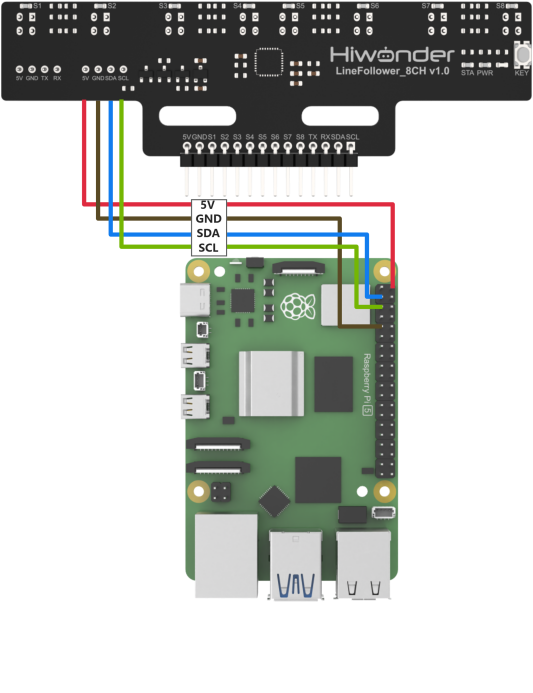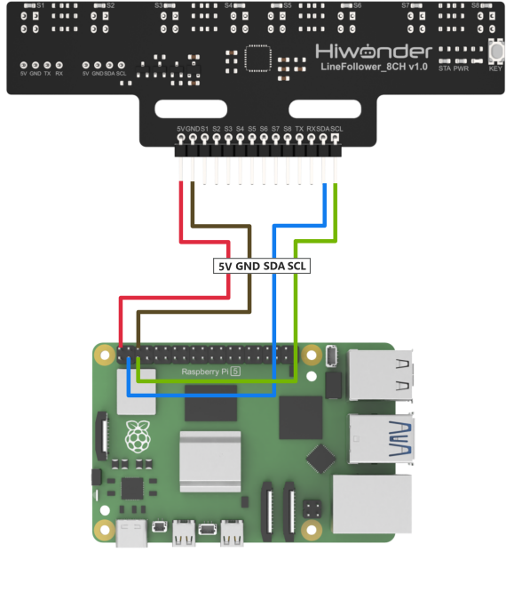

::: {Note}
Before powering on, ensure that no metal objects are touching the controller. Otherwise, the exposed pins at the bottom of the board may cause a short circuit and damage the controller.
:::

### 7.1.2 Environment Configuration

(1) Install MobaXterm on your computer. The software package can be found under the folder [Appendix->Raspberry Pi & Jetson Nano Tools Package->Remote Connection Tools](). For detailed instructions on how to use MobaXterm, refer to the corresponding document.

(2) Use MobaXterm to connect to the Raspberry Pi. Log in using the configured username and password, and drag the example program files into the Raspberry Pi system.

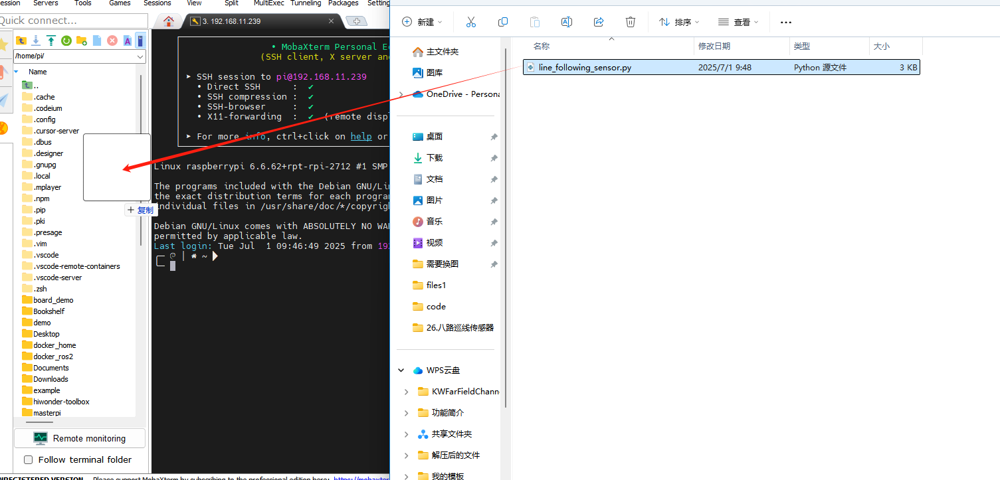

(3) In the MobaXterm terminal, enter the following command to access the system configuration menu:

```
sudo raspi-config
```

(4) Use the ↑, ↓, and Enter keys to navigate. Select **"Interface Options".**

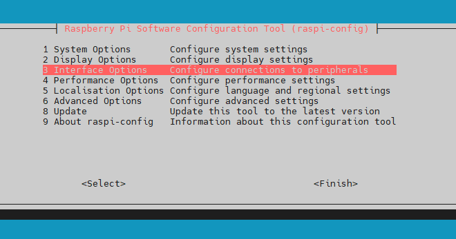

(5) Then choose "I2C".

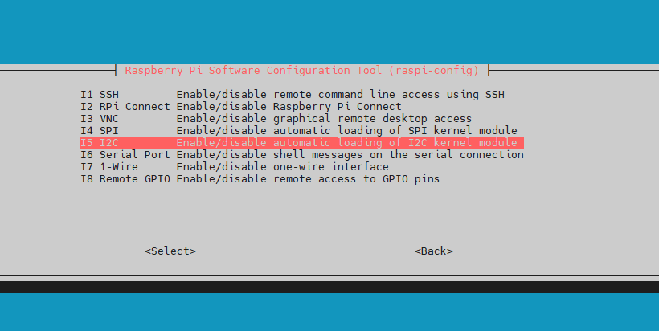

(6) In the prompts that follow, select "OK" for all options. If prompted to reboot, follow the instructions to restart the system.

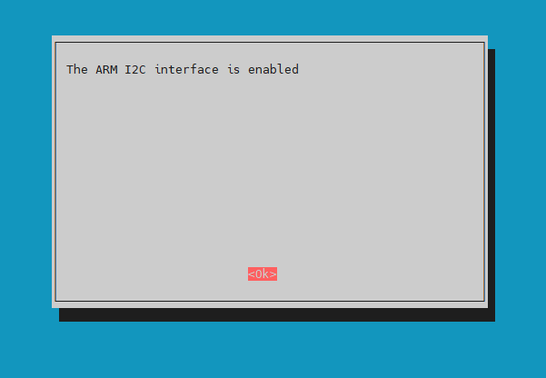

### 7.1.3 Test Case

This example reads data from the 8-ch line-following sensor via I2C and prints the status information in real time.

*   **Program Execution**

In the MobaXterm terminal, enter the following command to run the example:

```
python3 line_following_sensor.py
```

*   **Project Outcome**

The terminal will continuously print the real-time status of the 8-ch line-following sensor.

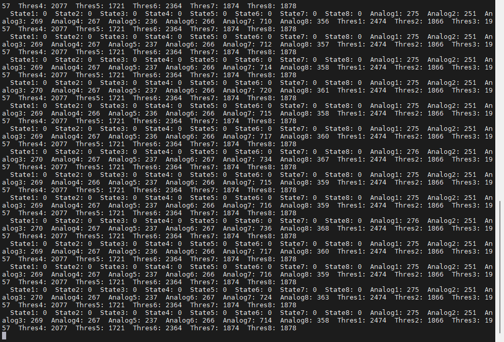

*   **Program Brief Analysis**

(1) Import Libraries

{lineno-start=1}
```python
import smbus
import time
```
Import the required libraries for the program. The `smbus` library is used to initialize the I2C communication interface.

(2) Define I2C Port Parameters

{lineno-start=5}
```python
# Define I2C parameters (定义I2C参数)
I2C_BUS = 1              # Raspberry Pi I2C bus number (树莓派I2C总线号)
SENSOR_SUM = 8           # Number of sensor channels (传感器通道数)
I2C_ADDR = 0x5D          # Sensor I2C address (传感器I2C地址)
SensorStateReg = 5       # Address of the sensor's all-channel state data register (传感器全通道状态数据寄存器地址)
SensorAnalogReg = 6      # Address of low 8 bits of analog value register for channel 1 (传感器通道1模拟值寄存器低8位地址)
SensorThresholdReg = 22  # Address of low 8 bits of threshold register for channel 1 (传感器通道1阈值寄存器低8位地址)
```
(3) Initialize I2C Object

{lineno-start=13}
```python
def setup():
    """Initialization function (初始化函数)"""
    global bus
    print("Initializing I2C... (初始化I2C...)")
    bus = smbus.SMBus(I2C_BUS)  # Initialize I2C (初始化I2C)
```
(4) Read and Print Data in a Loop

{lineno-start=19}
```python
def loop():
    """Main loop function (主循环函数)"""
    temp = [0] * (SENSOR_SUM * 2)
    data = [0] * SENSOR_SUM
    
    # Read state data (读取状态数据)
    state_byte = bus.read_byte_data(I2C_ADDR, SensorStateReg)
    for i in range(SENSOR_SUM):
        data[i] = (state_byte >> i) & 0x01  # Parse data and extract each channel's state value (解析数据，提取各通道状态值)
        print(f"  State{i+1}: {data[i]}", end="")  # Print the state of each sensor channel (打印传感器各通道状态)
    
    time.sleep(0.01)  # Delay 10ms (延时10ms)
```
## 7.2 UART Communication Instruction

### 7.2.1 Wiring Instruction

Connect the 5V, GND, TX, and RX pins of the 8-ch Line Follower to the corresponding pins on the Raspberry Pi controller. The wiring method is shown in the diagram below:

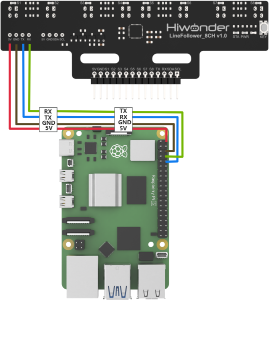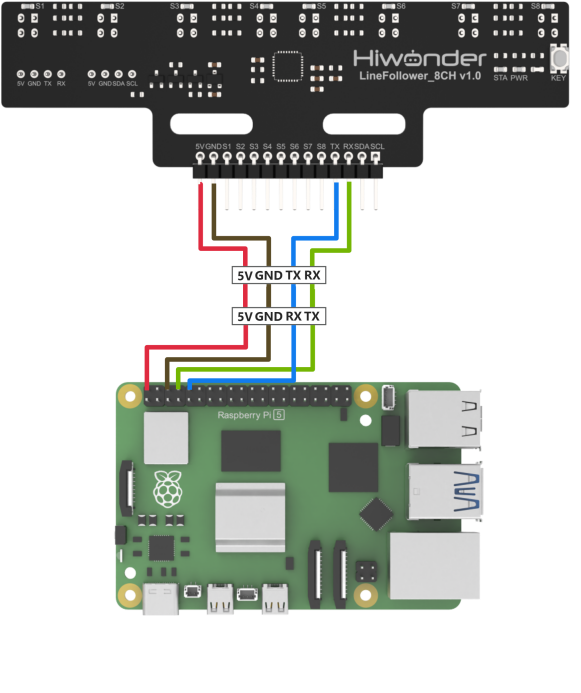

::: {Note}
Before powering on, ensure that no metal objects are touching the controller. Otherwise, the exposed pins at the bottom of the board may cause a short circuit and damage the controller.
:::

### 7.2.2 Environment Configuration

(1) Install MobaXterm on your computer. The software package can be found under the folder [Appendix->Raspberry Pi & Jetson Nano Tools Package->Remote Connection Tools](). For detailed instructions on how to use MobaXterm, refer to the corresponding document.

(2) Use MobaXterm to connect to the Raspberry Pi. Log in using the configured username and password, and drag the example program files into the Raspberry Pi system.


(3) In the MobaXterm terminal, enter the following command to access the system configuration menu:

```
sudo raspi-config
```

(4) Use the ↑, ↓, and Enter keys to navigate. Select "Interface Options".


(5) Select **"Serial Port"**.

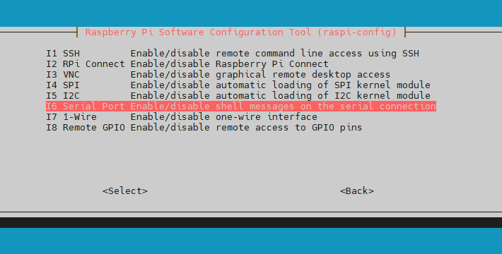

(6) In the prompts that follow, select **"Yes"** for all options. If prompted to reboot, follow the instructions to restart the system.

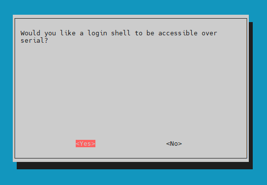
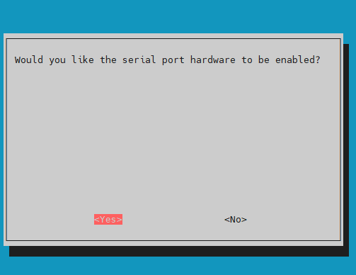

### 7.2.3 Test Case

This example reads data from the 8-ch line-following sensor via I2C and prints the status information in real time.

*   **Program Execution**

In the MobaXterm terminal, enter the following command to run the example:

```
sudo python3 line_following_sensor.py
```

*   **Project Outcome**

The terminal will continuously print the real-time status of the 8-ch line-following sensor.


*   **Program Brief Analysis**

(1) Import Libraries

{lineno-start=3}
```python
import serial
import time
```
Import the required libraries for the program. The `serial` library is used to initialize the serial communication interface.

(2) Define Serial Port Parameters

{lineno-start=6}
```python
SENSOR_SUM = 8
UART_PORT = '/dev/serial0'
BAUD_RATE = 115200
```
(3) Initialize Serial Port and Configure Reading Mode

{lineno-start=19}
```python
def main():
    try:
        uart = serial.Serial(UART_PORT, BAUD_RATE, timeout=1)
        print("Start test...")
        
        uart.write(bytes([1])) #  0: manual mode, 1: automatically send state data, 2: automatically send analog values, 3: automatically send threshold values (0：手动模式，1：自动发送状态数据，2：自动发送模拟值，3：自动发送阈值)

```
(4) Continuously Read Status Information

{lineno-start=28}
```python
        while True:
            data = [0] * SENSOR_SUM
            
            if uart.out_waiting == 0 and write_lock == 0:
                uart.write(bytes([1]))
                write_lock = 1
                
            if uart.in_waiting > 0 and write_lock == 1:
                temp = uart.read(1)
                if len(temp) > 0:
                    print("State:", end="")
                    for length in range(SENSOR_SUM):
                        data[length] = (temp[0] >> length) & 0x01
                        print(f" {data[length]}", end="")
                    print()
                    write_lock = 0
                    
            time.sleep(0.01)
```
(5) Continuously Read Analog Values

{lineno-start=47}
```python
            if uart.out_waiting == 0 and write_lock == 0:
                uart.write(bytes([2]))
                write_lock = 2
                
            if uart.in_waiting >= (SENSOR_SUM * 2 + 5) and write_lock == 2:
                temp = uart.read(SENSOR_SUM * 2 + 5)
                if len(temp) >= (SENSOR_SUM * 2 + 5):
                    if temp[0] == 0x55 and temp[1] == 0xAA:
                        if temp[2] == 0x02 and temp[3] == 0x10:
                            if temp[SENSOR_SUM * 2 + 4] == check_code(temp):
                                print("Analog:", end="")
                                count = 4
                                for length in range(SENSOR_SUM):
                                    data[length] = temp[count] | (temp[count + 1] << 8)
                                    print(f" {data[length]}", end="")
                                    count += 2
                                print()
                write_lock = 0
```
(6) Continuously Read Threshold Values

{lineno-start=68}
```python
            if uart.out_waiting == 0 and write_lock == 0:
                uart.write(bytes([3]))
                write_lock = 3
                
            if uart.in_waiting >= (SENSOR_SUM * 2 + 5) and write_lock == 3:
                temp = uart.read(SENSOR_SUM * 2 + 5)
                if len(temp) >= (SENSOR_SUM * 2 + 5):
                    if temp[0] == 0x55 and temp[1] == 0xAA:
                        if temp[2] == 0x03 and temp[3] == 0x10:
                            if temp[SENSOR_SUM * 2 + 4] == check_code(temp):
                                print("Thres:", end="")
                                count = 4
                                for length in range(SENSOR_SUM):
                                    data[length] = temp[count] | (temp[count + 1] << 8)
                                    print(f" {data[length]}", end="")
                                    count += 2
                                print()
                                print()
                write_lock = 0
```